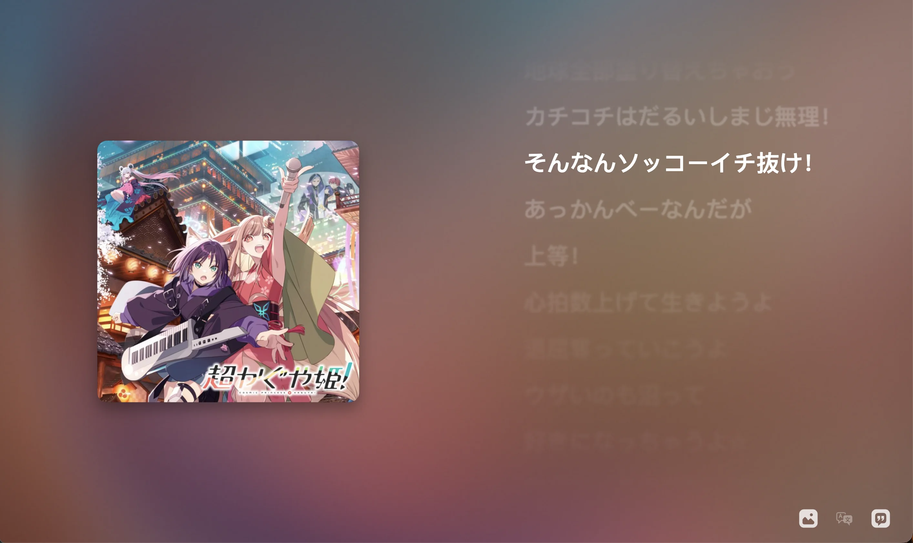
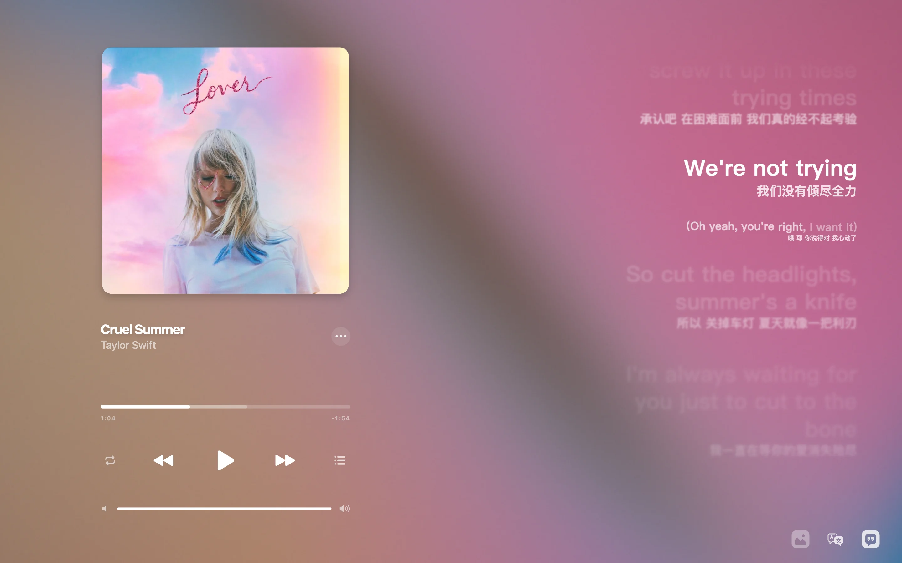
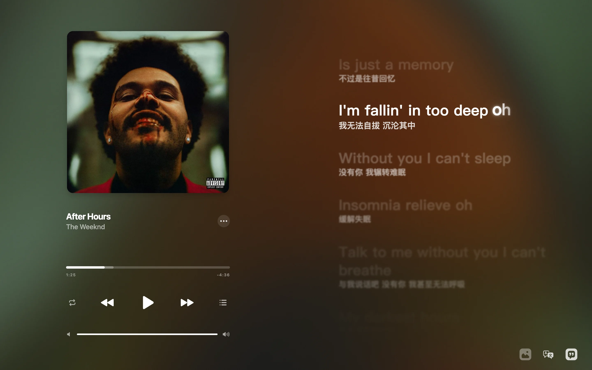
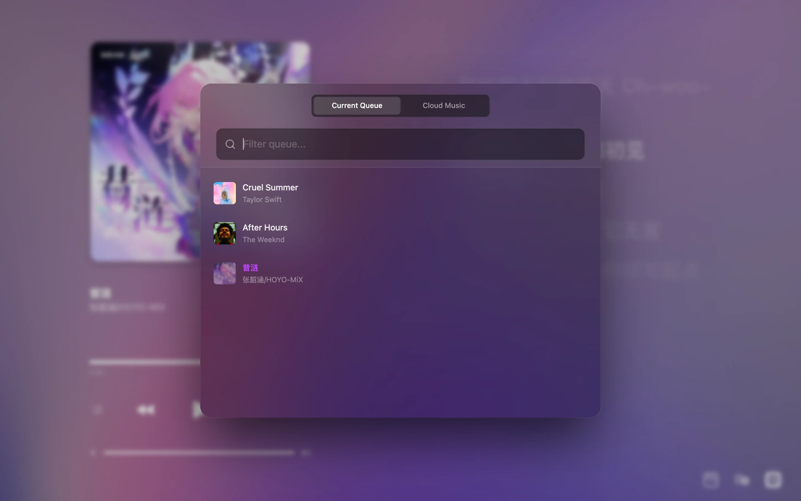
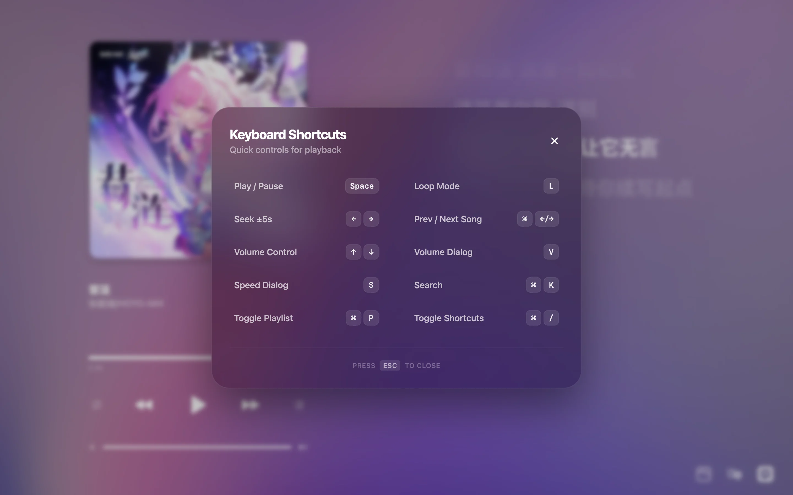

## Screenshot







> Shader source: https://www.shadertoy.com/view/wdyczG

> Vibe coding with gemini3-pro, gpt-5.1-codex-mini, and claude-sonnet-4.5. The first version only took 10 mins.

## Feature (Github Version)

- [x] **WebGL Fluid Background**: Implements a dynamic fluid background effect using WebGL shaders. [Reference](https://www.shadertoy.com/view/wdyczG)
- [x] **Canvas Lyric Rendering**: High-performance, custom-drawn lyric visualization on HTML5 Canvas.
- [x] **Music Import & Search**: Seamlessly search and import music from external providers or local files.
- [x] **Audio Manipulation**: Real-time control over playback speed and pitch shifting.

## Run locally

Use Node.js 20+ and Bun 1.3.14+.

```sh
bun install
bun run dev
bun test tests
bun run build
```

The app runs at `http://localhost:3000`. Production output is
`apps/web-player/dist`; use `bun run preview` to preview it. The default production
base is `/aura-music/`, configurable with `VITE_BASE_PATH`.

## Workspaces

| Workspace             | Responsibility                                           |
| --------------------- | -------------------------------------------------------- |
| `apps/web-player`     | Main player page, app metadata and PWA updates           |
| `packages/core`       | Types, audio analysis, caches, springs and generic hooks |
| `packages/player`     | Playback, playlist, import and provider services         |
| `packages/view`       | Controls, menus, dialogs, glass and localization         |
| `packages/lyrics`     | Lyrics parsing, timeline and canvas view                 |
| `packages/background` | WebGL2 background and worker                             |
| `packages/visualizer` | Audio visualizer and worker                              |

Packages expose TypeScript source through explicit exports; the consuming Vite
app bundles them and their workers. Package `build` scripts currently typecheck;
they do not produce standalone npm distributions. New player shells can consume
the same packages without importing `apps/web-player`.

```tsx
import { GlassDialog } from "@aura-music/view";
import "@aura-music/view/style.css";
```

See [glass implementation and design references](docs/liquid-glass.md) for the
macOS 27 material values, continuous corners, browser fallback and library patch.
