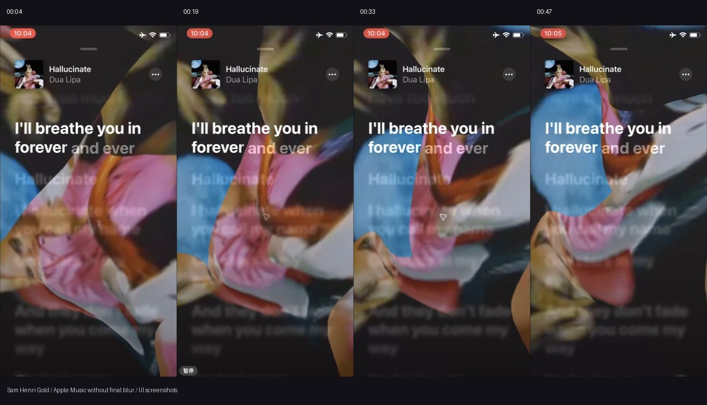
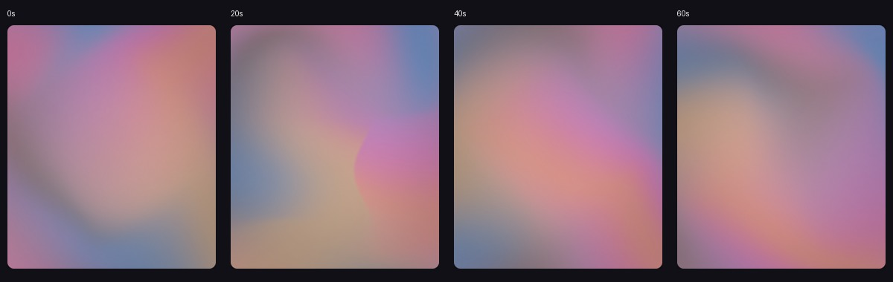
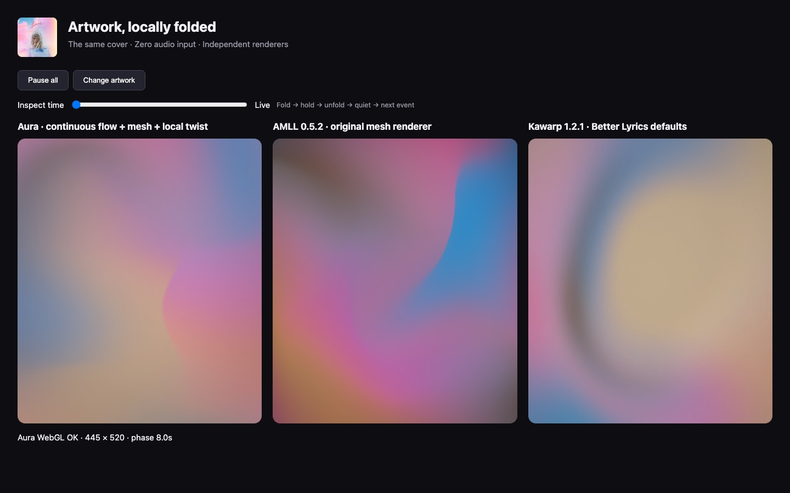
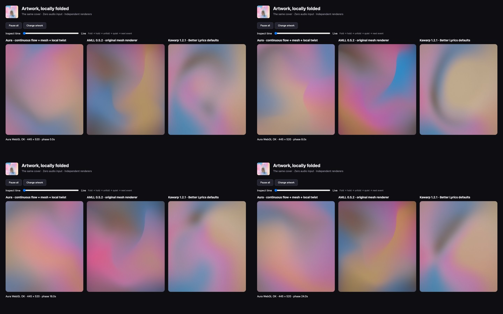

# Artwork-driven mesh and local twists

## What the reference actually shows

[Sam Henri Gold’s video](https://x.com/samhenrigold/status/1765220903963574290/video/1) shows Apple Music **without its final blur shader**. These are browser screenshots at approximately 4, 19, 33 and 47 seconds, cropped to the video:



The blue artwork fragment rises along the left edge while pink, white and orange fragments bend into overlapping sheets. The dark negative space remains broad. Different fragments change orientation and shape independently; one rigidly rotating image does not explain their motion. The author’s replies explicitly describe copies of artwork, each twisted in a Metal shader. The screenshots establish the visible behavior, not Apple’s exact layer count or parameters.

The [Aadish V reconstruction](https://www.aadishv.dev/music) gives the bounded twist used here. For `delta = uv - center`, `d = length(delta)`, radius `r`, and strength `a`:

```
w = max(0, 1 - d/r)
uv' = center + rotate(a * w*w) * delta
```

This convention fades the angle to zero at the radius, avoiding a seam with unaffected pixels. The exact center is stationary because its displacement is zero. The author’s prose about distance increasing rotation is not sufficient to recover an exact shader; this squared falloff is the reconstruction’s continuous interpretation.

## Combining this with AMLL

Reviewed [AMLL’s mesh renderer](https://github.com/amll-dev/applemusic-like-lyrics/tree/main/packages/core/src/bg-render/mesh-renderer) and its [Hermite mesh reference](https://movingparts.io/gradient-meshes). AMLL maps artwork through authored bicubic patches with tangent controls. Its original renderer also rotates texture coordinates and adjusts contrast/saturation. Aura retains Hermite interpolation, authored compositions, and real artwork sampling, while using independent bounded twists for movement.

Aura’s pipeline is now:

1. Downsample the complete cover to 128×128. Keep the cover’s source color relationship intact and composite transparent pixels over black; no additional saturation pass is applied by Aura.
2. Blur the source with four Kawase passes before deformation, suppressing recognizable faces and lettering while retaining broad color regions. One continuous artwork field carries the composition: broad deterministic coordinate displacement (the useful idea in Kawarp’s domain warp) and two bounded twists move its color regions. The complete artwork also rotates with varying angular speed around a drifting center, allowing its large color regions to exchange positions. Secondary rectangular cover layers were removed because their edges introduced visible cutouts.
3. Rasterize through a 4×4 Hermite surface with original authored anchor positions **and tangent directions/lengths**. Each patch uses 32 samples, which is enough for the bounded 768px target while keeping vertex work low. These morph between compositions while the screen perimeter remains fixed. Shared tangents maintain patch continuity. Intermittent folds are applied in surface coordinates before the moving surface is evaluated, so the occlusion boundary follows the mesh. A curved, parabolic fold center avoids long straight dividers. Its position, strength, size and hold time vary between seeded events. A compact vertical falloff limits the visible contour to one local arc, with aspect compensation on wide screens; its center continues moving during the hold.
4. Keep the Kawarp-style blur in the low-resolution artwork stage. It runs once when a cover arrives, then the deformed mesh is rendered into a bounded target capped at 768 pixels on its longest edge and copied to the screen at 60 FPS. Avoiding a repeated full-screen blur keeps the mesh contour clear and prevents the GPU from spending every frame on redundant samples.
5. Upscale with neutral shading and dithering. Only this final single-sample pass runs at full output resolution.

Four original twist presets (Ribbon, Cove, Wave, Fold) interpolate with quintic easing. Each transition takes about 20 seconds at the 0.4 playback-clock rate; control points repeat every 80 seconds. Bounded translation and broad coordinate displacement run independently. The geometry stays framed; the artwork sampling orientation changes continuously, combined with local twists rather than a rigid rotation of the entire screen. Track changes crossfade textures without resetting motion. Pausing freezes the phase. Rendering resources are resized and disposed with the worker.

### Fold lifetime and occlusion

The selected original AMLL preset contained triangles with both winding directions (2,259 opposed the majority in the inspected frame). This supports mesh foldover as a source of its sharp color boundaries. Aura uses an original controlled fold, without importing AMLL preset data or drawing a colored stroke.

Each 60-second event window has a variable start delay, roughly 6 seconds of folding in, a 10–20 second hold, 8 seconds of unfolding, then a quiet gap. A session seed varies the event sequence; the comparison harness fixes seed 17 for reproducibility. The envelope shares the playback clock, so pause/resume preserves its shape. Event parameters change while fold strength is zero to avoid visible jumps.

A 16-bit depth attachment selects a consistent front sheet by its source coordinate. Reversing every triangle's submission order produced **zero changed pixel channels** in the browser check. This fixes the overlapping triangular fragments that previously depended on draw order. The renderbuffer is bound before attachment and reallocated on resize; depth testing is disabled for the final copy.



Other visual research: [Stripe gradient breakdown](https://kevinhufnagl.com/how-to-stripe-website-gradient-effect/), [Paper Mesh Gradient](https://shaders.paper.design/mesh-gradient). The implementation and preset values are original; AMLL is not added as a production dependency.

## Rendered comparison and validation

[Better Lyrics’ Kawarp manager](https://github.com/better-lyrics/shaders/blob/master/contents/lib/kawarpManager.ts) delegates rendering to `@kawarp/core`. Its useful distinction is large-scale domain warping of an already blurred image; the manager adds playback/visibility lifecycle, opacity and audio speed/scale controls. We inspected both the manager and core rather than treating the manager as the shader itself.

The official `@applemusic-like-lyrics/core@0.5.2` and `@kawarp/core@1.2.1` packages were installed outside the repository solely for comparison. Chrome DevTools MCP used the persistent `~/.cache/chrome-devtools-mcp/chrome-profile` profile. All three renderers receive the same artwork, identical canvas dimensions and zero audio input. AMLL uses a fixed random seed for repeatability. Kawarp uses Better Lyrics’ documented defaults: warp 1, blur passes 8, speed 1, saturation 1.5, dithering 0.008 and opacity 0.75 over the dark page. This is its actual renderer with manager-equivalent settings, not the complete YouTube Music extension.



Frames below correspond to 0, 20, 40 and 60 seconds. The full cover’s spatial color relationships are visible across all three. AMLL has a more fixed, pronounced mesh contour; Kawarp has soft moving domains. Aura combines authored moving tangents, bounded twists and large-scale displacement. This is not a pixel-identical Apple Music reproduction.



The local development-only comparison remains at [/.background-review/](http://localhost:3000/.background-review/) while Vite runs. It supports play/pause, a time slider, and switching between the album and a synthetic high-contrast fixture. Its bundles and fixtures are ignored by Git and are not included in the production build. No AMLL or Kawarp production dependency was added.

Validation used MCP page JavaScript and screenshots:

- All three renderers reported WebGL error 0 at the four captured phases.
- Two paused snapshots were pixel-identical. A uniform source cover stayed consistent across the output after the expected color enhancement and neutral shading.
- Cover changes, portrait rendering and landscape resizing were checked. The actual production worker’s snapshot path was also exercised.
- The AMLL bundle emitted `EXT_color_buffer_float not supported` in the test browser, but rendered without a WebGL error.
- All 57 Bun tests, TypeScript checking and the production/PWA build passed. Tests cover Hermite patch continuity, the unfolded mesh’s geometry, bounded intentional folds, event continuity and quiet gaps, surface tracking, looping controls, neutral colors, hue-preserving enhancement and the existing audio/UI logic.

Pure instrumental notices, credits-only lyrics, and resolved empty lyrics automatically collapse the lyric panel using its existing opacity/width transition. Manual visibility overrides survive late lyric updates; short real vocal lyrics remain visible.
