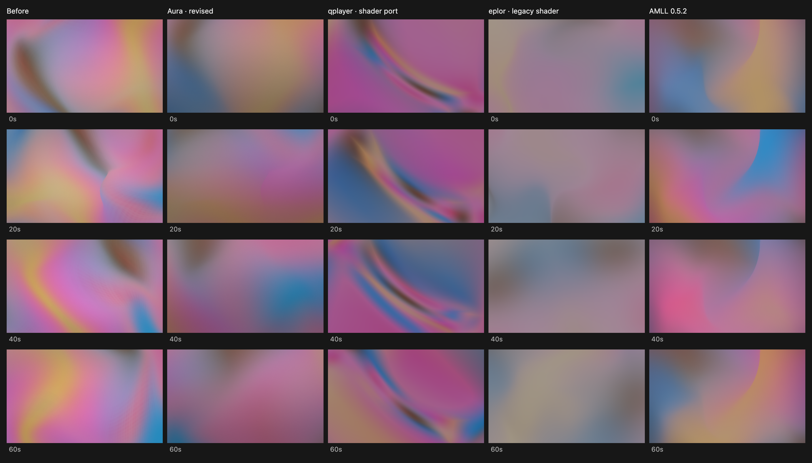
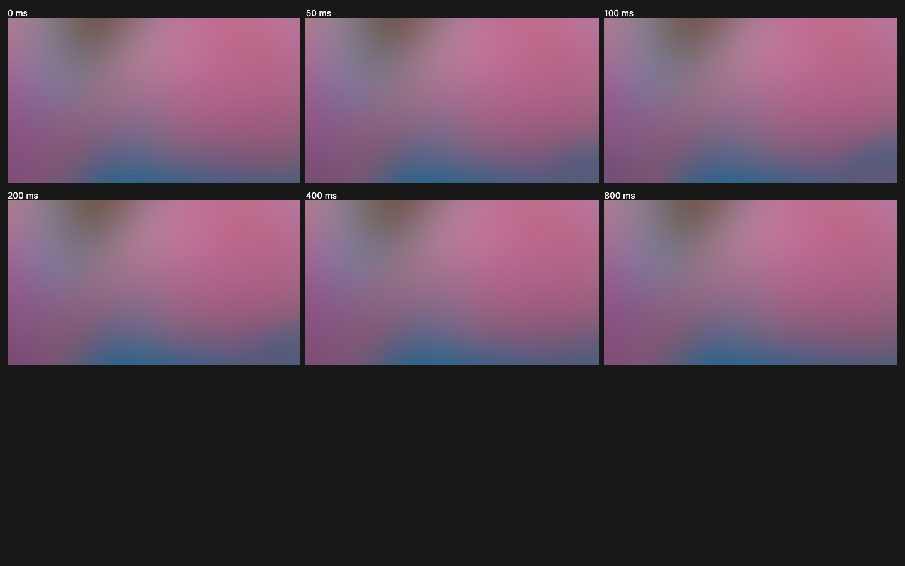

# Artwork-driven fluid background

## Visual target and comparisons

The current visual reference is the native **LyricsBlossom** application, observed with the Lover artwork playing. Its broad pink and blue-purple regions change position while retaining soft boundaries and a quieter, darker lower area. Recognizable portrait fragments and narrow dark ribbons are undesirable.

Two short screenshot sequences were also captured to examine audio response: eight frames over approximately five seconds and twelve frames over approximately eight seconds. Region widths and boundaries change without conspicuous whole-screen flashing. Capture intervals were approximately 0.4–1.5 seconds, so these observations do **not** establish the app's exact attack/release constants or isolate every kick from its background motion.

The development comparison uses the same cover and dimensions at 0, 20, 40 and 60 seconds:

- Aura's previous and revised workers.
- [qplayer's default Pixi-style shader](https://github.com/TIMER-err/qplayer/blob/main/player-core/src/main/resources/shaders/fluid/pixi_renderer.sksl), translated from SkSL to WebGL for study. This is a shader port, not the native qplayer application. Its 32px preprocessing is approximated with GPU box passes; initial sprite angles are fixed for repeatability.
- [AMLL legacy eplor shader](https://github.com/amll-dev/applemusic-like-lyrics/blob/legacy/packages/core/src/bg-render/shaders/eplor.frag.glsl) with [renderer settings](https://github.com/amll-dev/applemusic-like-lyrics/blob/legacy/packages/core/src/bg-render/eplor-renderer.ts). The shader is unchanged in the study; cover preprocessing is reproduced on the GPU, with a fixed starting phase. The native LyricsBlossom application may differ from this legacy renderer.
- The actual `@applemusic-like-lyrics/core@0.5.2` MeshGradientRenderer, using a fixed mesh seed and zero audio for visual comparisons.

Reference bundles and shader ports remain in the ignored development review folder. They are not production dependencies. The native app, rather than a reference-port screenshot, remains the appearance target.

## Production pipeline

1. Downsample a cover to 128×128 once using `drawImage`. There is no CPU pixel blur or `getImageData` in production cover preparation.
2. `Artwork` applies hue-preserving tone/chroma adjustment and Dual Kawase blur on the GPU. Reused targets follow 128 → 64 → 32 → 16 → 32 → 64 → 128. The final 128px texture is retained until the cover changes. Animation never reruns this pyramid.
3. Sample the blurred artwork off-center, with slow orientation changes and a bounded drift. This changes the original portrait composition instead of keeping its head/body relationship centered. Additional domain twists and strongly compressed multi-cover ribbons have been removed.
4. Evaluate the existing 4×4 Hermite surface in the vertex shader. Factor the tensor-product interpolation into x rows followed by a y combination: the position-weighting terms need 40 scalar multiplies instead of 64, excluding basis evaluation. The 97×97 mesh keeps the same vertices and triangles, ordered in 8×8-cell tiles to improve transformed-vertex cache reuse. Higher-u tiles draw first to reject hidden fold fragments through the existing depth test. Its 16 control points morph between layouts; shared tangents keep patch boundaries continuous. A seeded fold occasionally creates one localized moving arc. The arc comes from surface occlusion, not a painted line. A depth attachment makes sheet ordering consistent.
5. Render the mesh directly into the canvas, capped at 768px on its longest side. Exposure and subtle dithering are fused into this same fragment pass. Browser compositing provides the linear upscale; the separate fullscreen application pass, color target and explicit depth target are removed. The mesh retains its previous 768px contour resolution. Depth for fold ordering now belongs to the canvas and is invalidated after drawing. The lower area stays quieter behind player controls.
6. A WebGL2 transform-feedback prepass uses 19 vertex invocations to write a 608-byte uniform buffer: control points/tangents, fold, rotation/drift, beat direction and the two selected corners. The mesh reads that buffer directly; there is no CPU vertex calculation, buffer readback or per-frame vertex upload. UVs come from indexed `gl_VertexID`, so production no longer allocates the legacy CPU `Mesh` arrays or a separate GPU UV buffer. The smooth corner influence is evaluated at mesh vertices and interpolated, rather than recalculating two distances and cubic falloffs in every fragment.
7. Prepared cover textures use `MIRRORED_REPEAT`, letting the hardware sampler extend the image at its edges instead of recomputing `mod`/`abs` for each fragment sample. Kawase intermediate targets keep their existing sampling. Once artwork fully covers the surface, skip fallback palette evaluation; with no artwork, skip cover sampling. Fold strength is evaluated once per vertex and zero-strength regions bypass the fold math.

Cover transitions reuse the existing sampling and motion phase. Interrupted transitions blend the current two textures into a new small texture on the GPU before fading toward the next cover. The four scratch targets (128, 64, 32, 16) are reused during preparation, including the upsample steps. Once a transition settles, the previous cover, scratch textures and staging canvas storage are released. Only the final cover and 1px fallback textures remain; the browser owns the bounded canvas color/depth buffers. Clearing the cover releases its final texture too. Disposal releases textures, framebuffers, programs, buffers, VAOs and transform feedback, then acknowledges completion before the main thread terminates the worker (with a 1s fallback). Pending frame requests resolve on stop, and late snapshot bitmaps are closed. Snapshots use `createImageBitmap` instead of two full-frame CPU pixel buffers.

Rendering follows a demand-driven worker RAF with a 60 Hz submission limit, including on high-refresh displays. `isPlaying` defaults to false. Pausing freezes motion; after any pending artwork transition settles, the scheduler stops requesting callbacks altogether. Visibility changes stop the loop immediately and retain the same worker/canvas. They no longer read back a full frame into a second snapshot canvas. Resize, cover/color changes and resuming playback explicitly wake the scheduler. The Canvas2D fallback also stops idle callbacks.

GPU work is bounded by two in-flight fences, polled with a zero timeout. A busy GPU prevents another frame from being queued; there is no synchronous `finish` or wait. Where available, `EXT_disjoint_timer_query_webgl2` samples one frame in thirty, with at most one pending query. Sustained samples above 7ms lower the canvas limit in 12.5% steps, to a minimum scale of 62.5%. Sustained GPU headroom restores quality slowly; queue pressure supplies a fallback when timer queries are unavailable. Resolution can change under load, but the flow path, blur kernel, colors, beat timing and 60 Hz target stay unchanged. Canvas depth is used only for mesh occlusion, and its contents are invalidated after use for tiled GPUs. Fences and queries are released with the renderer.

These changes cover the background only. Glass controls and their renderer are outside this optimization.

## Low-frequency response

`FluidBackground.enableBeat` defaults to `false`; web-player explicitly enables it. The background subscribes to the shared audio envelope only when enabled, playing and visible. The AudioWorklet computes that envelope only while a consumer requests it and playback is active.

The PCM worklet uses two Butterworth biquad sections to isolate approximately 32–180 Hz, without another analyser or FFT. It combines stereo energy after filtering, preserving right-only and opposite-phase bass. Analysis windows are about 20ms (rounded to worklet blocks). Relative onset detection includes an absolute floor, hysteresis and a 100ms refractory period; quiet kicks remain detectable under louder treble, while sustained notes do not continuously retrigger. Filters and result storage are reused without per-sample allocations.

A bounded envelope uses a 45 ms attack and 320 ms release. These are Aura's chosen constants, not measured LyricsBlossom values. The GPU chooses two distinct corners from four using the renderer seed and an episode counter. A pair stays fixed throughout the bass rise and release; the next episode can choose another pair after the response settles. Sustained bass keeps the same pair. Compact smooth neighborhoods have radii of 0.68 and 0.62 times the shorter screen dimension, so the other corners remain unaffected in portrait and landscape layouts. Within these neighborhoods, two opposing artwork samples spread color regions apart and bring them back together as the envelope decays. Sampling displacement is approximately one third larger than the preceding local-region prototype; its direction follows the flow. Exposure, saturation and the playback clock do not change with each beat. When the envelope is negligible the shader uses one cover sample; a track crossfade adds a previous-cover sample only while needed.

The six-frame sequence holds the flow phase fixed to isolate the pulse. It is an Aura test signal, not a recording of LyricsBlossom.

## Validation

Chrome DevTools MCP uses `~/.cache/chrome-devtools-mcp/chrome-profile`.

- Captured multiple phases with pastel and dark portrait artwork, alongside qplayer, eplor and actual AMLL. Shader diagnostics reported WebGL error 0.
- Before the GPU-control/corner-response change, an equal-resolution shader/indexing A/B showed approximately 21–23% lower GPU time (0.541→0.427ms quiet, 0.568→0.440ms folded). These are historical results for that optimization, not the current renderer's measured gain.
- The current GPU control buffer matches CPU reference controls within about 1.2e-7 across eight phases. With the pulse disabled, 32 before/after GPU comparisons covered two artworks, four phases and landscape/portrait/4K requested sizes. After scaling both snapshots to the same presentation size, the maximum difference was two 8-bit channel values (mean about 0.25), due to moving exposure/dither ahead of compositing. At sizes below the 768px cap, the maximum was one. Kawase preprocessing and the underlying surface remain unchanged.
- Captured a six-frame fixed-phase pulse sequence. At the peak, approximately 15% of pixels changed by more than one channel value; the 800ms tail was close to the baseline. Landscape (480×270) and portrait (270×584) tests with three pairs found no differences above one channel value outside the two neighborhoods, allowing a small rasterization margin. Across 32 episodes the GPU produced all six possible distinct pairs and held them as the flow moved.
- The GPU-only control prepass initially added overhead. Fusing exposure and removing the final fullscreen pass recovered that cost. Alternating old/new/new/old desktop runs at a requested 3840×2160 used the old 1440×810 final surface / 768×432 mesh target versus the new direct 768×432 canvas. Across 16 old and 15 new sparse samples, GPU median was 1.036ms versus 0.630ms (about 39% lower on this machine). Instrumented render submission averaged 0.119–0.120ms old versus 0.106–0.108ms new. GPU timings contained outliers, and the new runs submitted about 56–58 FPS in that interval, so this does not demonstrate stable 60 FPS on every device. At smaller requested sizes, no clear overall GPU timing gain was established.
- Steady animation performs no texture uploads or readbacks. Forty rapid cover changes return to two live application textures (previously ten), with a peak of ten during interrupted crossfades; clearing artwork leaves one. A separate composition texture/framebuffer and the larger final surface are no longer allocated. Object counts are not a direct measurement of driver VRAM. Sync/query objects remain bounded, and every tracked GPU object count reaches zero on disposal. WebGL error remains zero.
- Pausing stops RAF callbacks and draws after transitions settle. Four real browser renderer lifecycles reclaimed every intentionally delayed, timed-out snapshot and terminated all four workers. Stop resolved pending frame requests immediately; ordinary snapshots still returned correctly sized images.
- A real AudioWorklet with an 80Hz input produced zero envelope messages while disabled, 19 in a 420ms enabled interval, and zero after disabling. This verifies demand gating with the new shorter analysis window.
- Bun tests cover quiet/loud kicks, onset latency below 50ms, no duplicate hits, treble/subsonic rejection, settled DC, right-only/opposite-phase stereo, quiet bass under treble, held corner episodes, pause/resume, GPU queue bounds and mesh continuity. All 78 tests and the production build pass.
- Scheduler tests simulate thirty minutes at 60/120/144Hz. This is simulated scheduling, **not** a thirty-minute Windows GPU soak. Windows long-run utilization and physical-phone sustained 60 FPS still require device checks.

Earlier mesh research included [the Stripe breakdown](https://kevinhufnagl.com/how-to-stripe-website-gradient-effect/), [Hermite meshes](https://movingparts.io/gradient-meshes), [Sam Henri Gold's unblurred reference](https://x.com/samhenrigold/status/1765220903963574290/video/1), and [Better Lyrics' Kawarp manager](https://github.com/better-lyrics/shaders/blob/master/contents/lib/kawarpManager.ts).
